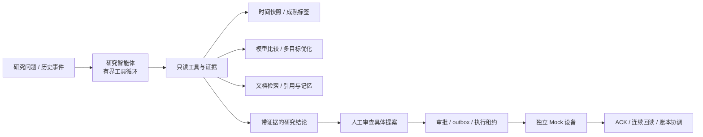

# CuLab｜铜电解电积研究智能体工作台

**让工艺研究结论有据可查，让决策执行有明确的审批和反馈。**

CuLab 将历史事件、预测与优化、文档知识和人工审批连接成可追踪的研究流程。研究智能体围绕问题选择只读工具，计算服务提供可复核结果，执行服务以具体参数审批和设备回读形成闭环。

- **研究能力统一接入**：38 个预测方法接口、26 个优化方法接口，模型登记、实验状态与发布资格分别管理。
- **关键工程链路可验证**：证据引用、任务恢复、预算记录、文档授权、精确审批与故障回读都有实现和测试。
- **公开演示可直接运行**：使用合成资料与独立 Mock 设备，验证正常执行和 ACK 丢失恢复，无需工厂资料或模型 API 密钥。

[运行演示](DEMO.md) · [面试问答与简历表述](INTERVIEW_QA.md) · [交付状态](CLOSEOUT.md) · [分支与演进](UPGRADE_BRANCHES.md) · [公开审查](PUBLICATION_REVIEW.md)

## 解决的问题

| 工艺研究中的问题 | CuLab 的处理方式 |
| --- | --- |
| 化验、过程信号和模型输出具有不同的可得时间 | 输入快照与成熟标签合同明确每次判断可以使用的证据 |
| 分析结论难以追溯到数据、模型和文档版本 | 工具结果以 evidence_id 关联，工件及引用绑定版本和哈希 |
| 预测、优化和知识查询分散在脚本中 | 研究智能体按问题选择工具，工作台统一查看结果与任务轨迹 |
| 候选方案到执行之间缺少可审查的衔接 | 提案绑定具体参数、版本与有效期，审批后进入独立执行服务 |
| 超时或通信异常容易造成重复操作 | 请求幂等、持久化 outbox、执行租约和设备账本协同恢复 |
| 文档撤销后旧回答仍可能被使用 | 来源变更会触发引用重新验证和关联派生回答清理 |

## 核心架构



开放式研究问题由智能体组织查询步骤；训练、求解、审批和执行由确定性服务处理。当前主路径是一个研究智能体与职责明确的计算、知识、任务和控制服务协作。

| 层次 | 主要实现 |
| --- | --- |
| 研究智能体 | [research_service.py](src/copper_mvp/research_service.py)、[research_tools.py](src/copper_mvp/research_tools.py) |
| 权限与任务 | [access.py](src/copper_mvp/access.py)、[research_store.py](src/copper_mvp/research_store.py) |
| 证据、记忆与知识 | [data_service.py](src/copper_mvp/data_service.py)、[research_memory.py](src/copper_mvp/research_memory.py)、[research_documents.py](src/copper_mvp/research_documents.py) |
| 模型与发布 | [model_lifecycle.py](src/copper_mvp/model_lifecycle.py)、[calibration_service.py](src/copper_mvp/calibration_service.py) |
| 执行与协调 | [commands.py](src/copper_mvp/control/commands.py)、[reconcile.py](src/copper_mvp/control/reconcile.py)、[mock.py](src/copper_mvp/control/mock.py) |
| 工作台 | React / TypeScript / Vite，十个工作区；FastAPI 提供接口，SQLite 保存任务和审计状态 |

历史 LangGraph 实验代码保留在 src/copper_langgraph_v2；当前研究主路径以 research_service.py 为准。

## 快速运行公开演示

使用 Python 3.11，在项目根目录安装依赖后运行：

```powershell
python -m pip install -e ".[mvp,dev]"
python -B scripts/demo_public.py
```

结果保存在 runs/public-demo 下的新运行目录，包括可读报告和结构化记录。演示重放固定决策轨迹，调用实际证据渲染、权限检查、审批和 Mock 协调代码；真实 LLM 的工具选择由研究主路径提供。

演示验证：

1. 本地数值按证据引用回填正确单位。
2. 未审批时不产生设备写入；研究员不能代替管理员审批。
3. 参数哈希不匹配时不能执行。
4. 正常流程完成三个连续合格回读。
5. ACK 丢失时查询设备账本恢复结果，设备写入次数保持为一次。

完整工作台的本地启动、授权资源和页面入口见 [DEMO.md](DEMO.md)。

## 已实现能力

- 历史数据、输入快照、标签可得时间和来源查询。
- 模型/优化器注册、固定协议比较、共享区间校准和模型生命周期。
- 自由研究对话、证据引用、任务暂停/恢复、调用预算和审计。
- 文档版本、解析/OCR、混合检索、正文授权与会话记忆。
- 合成 Mock 点位、精确审批、故障协调和结果回读。
- 总览、数据、模型、优化、研究助手、任务、控制、知识、领域适配入口及治理工作区。

算法接口数量表示接入范围，具体实验完成度和采用资格见 [CLOSEOUT.md](CLOSEOUT.md)。设备执行证据来自 Mock，当前公开交付的定位是本地研究与工程验证平台。

## 验证与工程交付

- 上一轮已有 74 个独立测试用例通过，并复现、修复了工件刷新、键盘焦点、上传重试和入口缓存四个问题。
- 本轮交付分支对工作区状态、数值回放和模型发布进行了 17 项专项回归，全部通过。
- 公开合成演示的正常执行和 ACK 丢失恢复均通过，真实模型调用数为 0。
- 仅导出 Git 源码、移除私密资源与模型密钥并阻断网络后，公开演示通过；公开协议测试 29 项通过。
- 数据、模型工件、凭据与内部资料不进入公开仓库；上传检查覆盖拟推送分支的完整可达历史。

## 分支与数据

默认交付分支为 codex/portfolio-release-20260916。main 保留升级前的 34933e0 基线，各阶段分支保留独立来源，不把升级内容合入 main。

本仓库提供源码、通用配置和合成验证。完整历史研究需要经授权的本地数据及相关运行时；正文外发、真实付费调用及现场设备接入按各自范围授权。第三方依赖和模型权重遵循各自项目许可，仓库不分发私密数据或训练权重。
