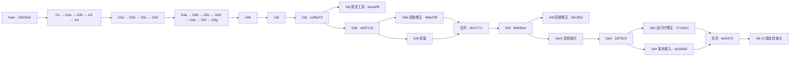

# 升级分支导航

本项目沿用设计文档中的 G 编号。每个阶段保存为独立分支；有依赖的阶段从对应源码节点继续，无依赖的补充工作从共同基点分出，再通过合并提交集成。

## 2026-09-15 收尾检查点

完整升级按用户要求暂停，当前保留已有成果，待明确恢复后再继续。

- 固定分支 codex/g8-ui：a04d31c，十工作区初始界面检查点。
- 固定分支 codex/g8-models-checkpoint：本次新增的模型流程检查点，继承 a04d31c。保存影子回放进度与历史、发布提案复查、退休/回退界面、集成研究入口以及对应的权限范围读取接口。
- codex/g8：恢复 G8 工作时的入口；main 继续保留 34933e0 基线。

本次只做保存与启动核验。相关 13 项测试在前次修改后通过；本次 TypeScript 检查、前端构建、认证后的只读接口和浏览器首屏启动检查通过。新模型发布/回退界面尚未完成完整交互验收；G7、部分模型验收和远端同步继续保留为未完成。

G6j 与 G6l 的原实验进程当前均不存在，文件中残留的 running 状态不代表实验仍在运行。本次保留全部原始工件，不重启或修改其结果文件。详细恢复顺序与本地证据见工作区的收尾交接记录。

## 先看这三个入口

- [main](https://github.com/s1encisi/culab-copper-workbench/tree/main)：升级前基线，固定在 34933e0，本轮升级没有修改它。
- [codex/system-upgrade](https://github.com/s1encisi/culab-copper-workbench/tree/codex/system-upgrade)：已集成阶段的汇总入口。本地为 9765f3e，GitHub 为 31d6cab；目前集成到 G6g。
- 本地 codex/g8-ui：十工作区界面的固定检查点，继承 G6n 校准发布接口。codex/g8 继续承接界面整合；此检查点不等于整轮升级验收完成。

源码已保存、实验已验收和已上传 GitHub 是三件不同的事，下表分别记录。G7 尚未实施；G8 先使用现有后端完成界面整合，领域适配入口明确显示服务尚未接入。

## 已上传的阶段

查看某阶段的完整项目，打开分支；只看该阶段的改动，打开“本阶段差异”。以下远端状态于 2026-09-13 通过 git ls-remote 核实。

| 阶段 | 分支 | 继承阶段 | 改动主题 | 阶段源码提交 | 本阶段差异 | 状态 |
| --- | --- | --- | --- | --- | --- | --- |
| G1 | [`codex/g1`](https://github.com/s1encisi/culab-copper-workbench/tree/codex/g1) | main | 数据、时间边界与事件证据 | [`d2ea1eb`](https://github.com/s1encisi/culab-copper-workbench/commit/d2ea1eb873e989b41feb5b70c46cf60965dd1b7d) | [查看](https://github.com/s1encisi/culab-copper-workbench/compare/main...codex/g1) | 已上传源码节点 |
| G2a | [`codex/g2a`](https://github.com/s1encisi/culab-copper-workbench/tree/codex/g2a) | G1 | 模型注册与固定协议比较 | [`24949dd`](https://github.com/s1encisi/culab-copper-workbench/commit/24949ddfa2b497e4287753823d798833e175f58d) | [查看](https://github.com/s1encisi/culab-copper-workbench/compare/codex/g1...codex/g2a) | 已上传源码节点 |
| G2b | [`codex/g2b`](https://github.com/s1encisi/culab-copper-workbench/tree/codex/g2b) | G2a | 优化器注册与统一评价 | [`0a86817`](https://github.com/s1encisi/culab-copper-workbench/commit/0a868173f88566cefd4116823a44ec9d4fc63ef6) | [查看](https://github.com/s1encisi/culab-copper-workbench/compare/codex/g2a...codex/g2b) | 已上传源码节点 |
| G3 | [`codex/g3`](https://github.com/s1encisi/culab-copper-workbench/tree/codex/g3) | G2b | 研究对话、权限与任务恢复 | [`80b85e3`](https://github.com/s1encisi/culab-copper-workbench/commit/80b85e3f482438e8017793fdd65ba4b317099ada) | [查看](https://github.com/s1encisi/culab-copper-workbench/compare/codex/g2b...codex/g3) | 已上传源码节点 |
| G4 | [`codex/g4`](https://github.com/s1encisi/culab-copper-workbench/tree/codex/g4) | G3 | Mock 控制、精确审批与回读 | [`e4c5ef5`](https://github.com/s1encisi/culab-copper-workbench/commit/e4c5ef54c4cd443835590e835479822fcec3d947) | [查看](https://github.com/s1encisi/culab-copper-workbench/compare/codex/g3...codex/g4) | 已上传源码节点 |
| G5a | [`codex/g5a`](https://github.com/s1encisi/culab-copper-workbench/tree/codex/g5a) | G4 | 成熟标签评价与影子路由 | [`27923fd`](https://github.com/s1encisi/culab-copper-workbench/commit/27923fdd31a46a161038ca5fa100c4a36b26c748) | [查看](https://github.com/s1encisi/culab-copper-workbench/compare/codex/g4...codex/g5a) | 已上传源码节点 |
| G5b | [`codex/g5b`](https://github.com/s1encisi/culab-copper-workbench/tree/codex/g5b) | G5a | 嵌套 OOF 集成与时间块 Bagging | [`37f47c2`](https://github.com/s1encisi/culab-copper-workbench/commit/37f47c22dbcba68b40d94169a2ce13b1a5a7a6f0) | [查看](https://github.com/s1encisi/culab-copper-workbench/compare/codex/g5a...codex/g5b) | 已上传源码节点 |
| G5c | [`codex/g5c`](https://github.com/s1encisi/culab-copper-workbench/tree/codex/g5c) | G5b | 模型工件登记、发布与回退 | [`a0ba976`](https://github.com/s1encisi/culab-copper-workbench/commit/a0ba976e6f2f6b84f160ec0958210935f3a46cef) | [查看](https://github.com/s1encisi/culab-copper-workbench/compare/codex/g5b...codex/g5c) | 已上传源码节点 |
| G5d | [`codex/g5d`](https://github.com/s1encisi/culab-copper-workbench/tree/codex/g5d) | G5c | 优化器组合与配对比较 | [`1c46bf1`](https://github.com/s1encisi/culab-copper-workbench/commit/1c46bf1083f401c9455d4b3d1ed06c1c2ad544b8) | [查看](https://github.com/s1encisi/culab-copper-workbench/compare/codex/g5c...codex/g5d) | 已上传源码节点 |
| G6a | [`codex/g6a`](https://github.com/s1encisi/culab-copper-workbench/tree/codex/g6a) | G5d | 经典预测方法扩展 | [`19bcef6`](https://github.com/s1encisi/culab-copper-workbench/commit/19bcef6d7ba497bfe396a1e408129d4f90bc886d) | [查看](https://github.com/s1encisi/culab-copper-workbench/compare/codex/g5d...codex/g6a) | 已上传源码节点 |
| G6b | [`codex/g6b`](https://github.com/s1encisi/culab-copper-workbench/tree/codex/g6b) | G6a | 统计与事件序列方法 | [`6149b91`](https://github.com/s1encisi/culab-copper-workbench/commit/6149b910993013aa3864a11942482c925b143582) | [查看](https://github.com/s1encisi/culab-copper-workbench/compare/codex/g6a...codex/g6b) | 已上传源码节点 |
| G6c | [`codex/g6c`](https://github.com/s1encisi/culab-copper-workbench/tree/codex/g6c) | G6b | pymoo 优化方法扩展 | [`00f231e`](https://github.com/s1encisi/culab-copper-workbench/commit/00f231ed0975551c9c3de2918910129eb3d694a1) | [查看](https://github.com/s1encisi/culab-copper-workbench/compare/codex/g6b...codex/g6c) | 已上传源码节点 |
| G6d | [`codex/g6d`](https://github.com/s1encisi/culab-copper-workbench/tree/codex/g6d) | G6c | Platypus 优化方法扩展 | [`79f75c7`](https://github.com/s1encisi/culab-copper-workbench/commit/79f75c7946f26de8646f8187c3dd626627bd762f) | [查看](https://github.com/s1encisi/culab-copper-workbench/compare/codex/g6c...codex/g6d) | 已上传源码节点 |
| G6e | [`codex/g6e`](https://github.com/s1encisi/culab-copper-workbench/tree/codex/g6e) | G6d | HypE 与标量化前沿 | [`0d4d3e5`](https://github.com/s1encisi/culab-copper-workbench/commit/0d4d3e5a9d09a582d978055fe887bfbb4ce70e84) | [查看](https://github.com/s1encisi/culab-copper-workbench/compare/codex/g6d...codex/g6e) | 已上传源码节点 |
| G6f | [`codex/g6f`](https://github.com/s1encisi/culab-copper-workbench/tree/codex/g6f) | G6e | 贝叶斯多目标优化与独立复核 | [`941e658`](https://github.com/s1encisi/culab-copper-workbench/commit/941e6585e6e2ad5ac7c3e3ed197f3be7906a648f) | [查看](https://github.com/s1encisi/culab-copper-workbench/compare/codex/g6e...codex/g6f) | 已上传源码节点 |
| G6g | [`codex/g6g`](https://github.com/s1encisi/culab-copper-workbench/tree/codex/g6g) | G6f | CatBoost、NGBoost、EBM、Cubist 与概率评分 | [`31d6cab`](https://github.com/s1encisi/culab-copper-workbench/commit/31d6cab4cf0db4aab7309cba94d350a5f3bc88af) | [查看](https://github.com/s1encisi/culab-copper-workbench/compare/codex/g6f...codex/g6g) | 已上传源码节点 |

G6g 本地另有归档说明提交 9765f3e，尚未上传。G1–G5a 沿用原提交；G5b–G6f 依据原阶段文件哈希恢复，原有审计记录保留在本地。

## 后续本地阶段

以下分支尚未上传，不提供尚不存在的 GitHub 分支链接。“研究验收通过”不表示默认模型已经替换。

| 阶段分支 | 实际依赖节点 | 当前源码节点 | 内容与验收状态 |
| --- | --- | --- | --- |
| `codex/g6h` | G6g · 9765f3e | `7addfb8` | BART 采样与便携推理；扩展采样仍有诊断不通过，未完成验收 |
| `codex/g6i` | G6h · 7addfb8 | `8a846b4` | 符号回归与公式导出；独立研究验收通过 |
| `codex/g6j` | G6i · 8a846b4 | `9cea2f9` | TabNet、FTTransformer、NODE 与匹配 MLP 对照；末个种子比较未完成；进程已停止，对照与验收待完成 |
| `codex/g6k` | G6j · ce9bd72 | `96bd78f` | GRU、LSTM、因果 TCN；独立研究验收通过 |
| `codex/g6l` | G6k · eb971c0；经 db7e771 合入 96bd78f | `65c2f5e` | TabPFN；五种子正式比较完成，保存工件回放验收未完成，进程已停止 |
| `codex/g6m` | G6l · 966d5ed | `1cde3e3` | 文档知识、OCR、记忆、受控引用和可选重排；本地接口验收通过，真实模型与独立领域评估待完成 |
| `codex/g6n` | G6m · 1cde3e3 | `1711b51` | 共享时序校准；正式比较及保存工件回放完成 |
| `codex/g6n-release` | G6n · 33f7623；经 6ef5379 合入 1711b51 | `6ef5379` | 校准工件登记、影子回放与发布判定；接入验收通过，候选未通过质量门槛，未切换默认模型 |
| `codex/g8` / 固定 `codex/g8-ui` | G6n release · 6ef5379 | 见固定分支 HEAD | 十工作区界面检查点；构建、权限摘要测试和三尺寸导航通过，完整功能验收仍在进行 |
| G7（尚未建分支） | 实施时从所需已验收后端建立 | — | 领域适配与独立对照评估尚未实施 |

## 每项功能的固定检查点

| 固定分支 | 继承节点 | 独立改动 | 源码提交 |
| --- | --- | --- | --- |
| `codex/g6m-core` | G6l · 966d5ed | 文档登记、结构解析、本地混合检索 | `b3e0951` |
| `codex/g6m-ocr` | G6m core | 离线 OCR、页图定位、解析修订与审核 | `3edf0f9` |
| `codex/g6m-memory` | G6m OCR | 权威会话记忆、本地引用与缓存失效 | `a658297` |
| `codex/g6m-rag` | G6m memory；保留导航提交 | 正文授权、逐片段引用与派生回答清理 | `ccc3dc6` |
| `codex/g6m-rerank` | G6m RAG | 可选本地重排与逐条规则解析 | `1cde3e3` |
| `codex/g6l-replay` | G6l · 966d5ed | TabPFN 专属数值回放精度规则 | `65c2f5e` |
| `codex/g8-ui` | G6n release · 6ef5379 | 十工作区导航、知识/模型操作界面、任务与费用摘要 | 固定分支 HEAD |

固定分支保留该次改动的终点。后续改动提交到阶段工作分支，并按功能新增检查点，不覆盖已有检查点。

## 交叉依赖与待合并修正

G6j 的恢复工具 9cea2f9 和 G6l 的回放修正 65c2f5e 尚未合入 G8 所继承的源码。这些修正留在各自分支，避免改变正在验收的实验源码；后续集成以明确的合并提交记录。图中的 G6m 还可按上表五个功能检查点展开。

## 查看差异与后续规则

- 累计已集成升级：比较 main 与 codex/system-upgrade。
- 单阶段改动：比较该阶段的“实际依赖节点”与阶段分支。存在分叉时，使用表中固定提交作为基点，避免把另一条分支后加的改动混入比较。
- G8 界面检查点：比较 codex/g6n-release 与 codex/g8-ui。
- 已共享的提交保持原样。修正使用新提交；并行分支使用合并提交，保留各自来源。
- 阶段验收完成并合入汇总分支后，再更新汇总入口。main 继续保留升级前的状态。

## 验证与上传边界

G8 UI 检查点已通过 TypeScript 检查、Vite 生产构建及新增工作区接口的账号隔离测试。1440×1000、1920×1000、390×844 下的十工作区导航均无页面横向溢出、框架错误覆盖层或浏览器错误。此前还执行了本地预测、训练、快速优化候选保存、合成文档检索和合成 Mock 审批回读流程。付费诊断未执行，领域适配服务未接入，模型生命周期与文档权限的完整界面验收仍待完成；这些限制不被标记为验收通过。

Excel、行级数据、模型、数据库、访问凭据、内部文档、截图和验收原始记录继续留在被忽略的本地目录。本文件只记录通用功能、源码节点和验证范围。

远端推送目前受自动审批限制：对 G6g 归档提交及后续源码的上传尚未获准。本地分支已保留，未绕过该限制上传；解除后再按准确分支清单同步，最后重新核对远端引用。
