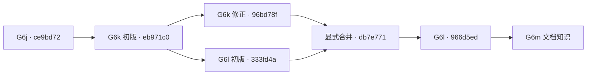

# 升级分支导航

每个阶段都有独立分支，后一个阶段继承前一个阶段的源码。查看某阶段的全部文件，打开分支；只看该阶段新增或修改的内容，打开表中的“本阶段差异”。

## 主线与当前工作

- [main](https://github.com/s1encisi/culab-copper-workbench/tree/main)：升级前基线，固定为 `34933e0`。
- [codex/system-upgrade](https://github.com/s1encisi/culab-copper-workbench/tree/codex/system-upgrade)：已集成升级的汇总入口；本地与 G6g 同为 `9765f3e`，远端仍为 `31d6cab`。
- [codex/g6g](https://github.com/s1encisi/culab-copper-workbench/tree/codex/g6g)：当前汇总分支中的已验证阶段。后续 G6h–G6m 保存在各自的本地分支；验收和远端同步状态见下表。
- G7、G8 尚未开始；开始实施时再从其所依赖的阶段建立分支。

## 阶段顺序与差异

“已归档”表示这个源码节点已保存，不代表整轮升级全部验收完成。G1 至 G5a 保留原有提交；G5b 至 G6f 根据当时保存的文件哈希恢复，130 个阶段文件版本全部一致。G6g 的源代码和验收已保存；后续 BART、符号与神经预测方法、共享校准和知识能力继续分阶段实现。

| 阶段 | 分支 | 继承阶段 | 改动主题 | 阶段源码提交 | 本阶段差异 | 状态 |
| --- | --- | --- | --- | --- | --- | --- |
| G1 | [`codex/g1`](https://github.com/s1encisi/culab-copper-workbench/tree/codex/g1) | main | 数据、时间边界与事件证据 | [`d2ea1eb`](https://github.com/s1encisi/culab-copper-workbench/commit/d2ea1eb873e989b41feb5b70c46cf60965dd1b7d) | [查看](https://github.com/s1encisi/culab-copper-workbench/compare/main...codex/g1) | 已归档 |
| G2a | [`codex/g2a`](https://github.com/s1encisi/culab-copper-workbench/tree/codex/g2a) | G1 | 模型注册与固定协议比较 | [`24949dd`](https://github.com/s1encisi/culab-copper-workbench/commit/24949ddfa2b497e4287753823d798833e175f58d) | [查看](https://github.com/s1encisi/culab-copper-workbench/compare/codex/g1...codex/g2a) | 已归档 |
| G2b | [`codex/g2b`](https://github.com/s1encisi/culab-copper-workbench/tree/codex/g2b) | G2a | 优化器注册与统一评价 | [`0a86817`](https://github.com/s1encisi/culab-copper-workbench/commit/0a868173f88566cefd4116823a44ec9d4fc63ef6) | [查看](https://github.com/s1encisi/culab-copper-workbench/compare/codex/g2a...codex/g2b) | 已归档 |
| G3 | [`codex/g3`](https://github.com/s1encisi/culab-copper-workbench/tree/codex/g3) | G2b | 研究对话、权限与任务恢复 | [`80b85e3`](https://github.com/s1encisi/culab-copper-workbench/commit/80b85e3f482438e8017793fdd65ba4b317099ada) | [查看](https://github.com/s1encisi/culab-copper-workbench/compare/codex/g2b...codex/g3) | 已归档 |
| G4 | [`codex/g4`](https://github.com/s1encisi/culab-copper-workbench/tree/codex/g4) | G3 | Mock 控制、精确审批与回读 | [`e4c5ef5`](https://github.com/s1encisi/culab-copper-workbench/commit/e4c5ef54c4cd443835590e835479822fcec3d947) | [查看](https://github.com/s1encisi/culab-copper-workbench/compare/codex/g3...codex/g4) | 已归档 |
| G5a | [`codex/g5a`](https://github.com/s1encisi/culab-copper-workbench/tree/codex/g5a) | G4 | 成熟标签评价与影子路由 | [`27923fd`](https://github.com/s1encisi/culab-copper-workbench/commit/27923fdd31a46a161038ca5fa100c4a36b26c748) | [查看](https://github.com/s1encisi/culab-copper-workbench/compare/codex/g4...codex/g5a) | 已归档 |
| G5b | [`codex/g5b`](https://github.com/s1encisi/culab-copper-workbench/tree/codex/g5b) | G5a | 嵌套 OOF 集成与时间块 Bagging | [`37f47c2`](https://github.com/s1encisi/culab-copper-workbench/commit/37f47c22dbcba68b40d94169a2ce13b1a5a7a6f0) | [查看](https://github.com/s1encisi/culab-copper-workbench/compare/codex/g5a...codex/g5b) | 已归档 |
| G5c | [`codex/g5c`](https://github.com/s1encisi/culab-copper-workbench/tree/codex/g5c) | G5b | 模型工件登记、发布与回退 | [`a0ba976`](https://github.com/s1encisi/culab-copper-workbench/commit/a0ba976e6f2f6b84f160ec0958210935f3a46cef) | [查看](https://github.com/s1encisi/culab-copper-workbench/compare/codex/g5b...codex/g5c) | 已归档 |
| G5d | [`codex/g5d`](https://github.com/s1encisi/culab-copper-workbench/tree/codex/g5d) | G5c | 优化器组合与配对比较 | [`1c46bf1`](https://github.com/s1encisi/culab-copper-workbench/commit/1c46bf1083f401c9455d4b3d1ed06c1c2ad544b8) | [查看](https://github.com/s1encisi/culab-copper-workbench/compare/codex/g5c...codex/g5d) | 已归档 |
| G6a | [`codex/g6a`](https://github.com/s1encisi/culab-copper-workbench/tree/codex/g6a) | G5d | 经典预测方法扩展 | [`19bcef6`](https://github.com/s1encisi/culab-copper-workbench/commit/19bcef6d7ba497bfe396a1e408129d4f90bc886d) | [查看](https://github.com/s1encisi/culab-copper-workbench/compare/codex/g5d...codex/g6a) | 已归档 |
| G6b | [`codex/g6b`](https://github.com/s1encisi/culab-copper-workbench/tree/codex/g6b) | G6a | 统计与事件序列方法 | [`6149b91`](https://github.com/s1encisi/culab-copper-workbench/commit/6149b910993013aa3864a11942482c925b143582) | [查看](https://github.com/s1encisi/culab-copper-workbench/compare/codex/g6a...codex/g6b) | 已归档 |
| G6c | [`codex/g6c`](https://github.com/s1encisi/culab-copper-workbench/tree/codex/g6c) | G6b | pymoo 优化方法扩展 | [`00f231e`](https://github.com/s1encisi/culab-copper-workbench/commit/00f231ed0975551c9c3de2918910129eb3d694a1) | [查看](https://github.com/s1encisi/culab-copper-workbench/compare/codex/g6b...codex/g6c) | 已归档 |
| G6d | [`codex/g6d`](https://github.com/s1encisi/culab-copper-workbench/tree/codex/g6d) | G6c | Platypus 优化方法扩展 | [`79f75c7`](https://github.com/s1encisi/culab-copper-workbench/commit/79f75c7946f26de8646f8187c3dd626627bd762f) | [查看](https://github.com/s1encisi/culab-copper-workbench/compare/codex/g6c...codex/g6d) | 已归档 |
| G6e | [`codex/g6e`](https://github.com/s1encisi/culab-copper-workbench/tree/codex/g6e) | G6d | HypE 与标量化前沿 | [`0d4d3e5`](https://github.com/s1encisi/culab-copper-workbench/commit/0d4d3e5a9d09a582d978055fe887bfbb4ce70e84) | [查看](https://github.com/s1encisi/culab-copper-workbench/compare/codex/g6d...codex/g6e) | 已归档 |
| G6f | [`codex/g6f`](https://github.com/s1encisi/culab-copper-workbench/tree/codex/g6f) | G6e | 贝叶斯多目标优化与独立复核 | [`941e658`](https://github.com/s1encisi/culab-copper-workbench/commit/941e6585e6e2ad5ac7c3e3ed197f3be7906a648f) | [查看](https://github.com/s1encisi/culab-copper-workbench/compare/codex/g6e...codex/g6f) | 已归档 |
| G6g | [`codex/g6g`](https://github.com/s1encisi/culab-copper-workbench/tree/codex/g6g) | G6f | CatBoost、NGBoost、EBM、Cubist 与概率评分 | [`31d6cab`](https://github.com/s1encisi/culab-copper-workbench/commit/31d6cab4cf0db4aab7309cba94d350a5f3bc88af) | [查看](https://github.com/s1encisi/culab-copper-workbench/compare/codex/g6f...codex/g6g) | 已归档 |

## 后续本地阶段

下表的分支已经存在于本机，尚未推送到 GitHub，因此暂不提供不存在的远端比较链接。这里的“研究验收通过”指该阶段独立实验通过，不代表已切换工作台默认模型。

| 阶段 | 本地分支 | 依赖与实际继承 | 本阶段内容 | 当前状态 |
| --- | --- | --- | --- | --- |
| G6h | `codex/g6h` | G6g | BART 后验采样、诊断与便携推理 | 代码保存至 `7addfb8`；五个种子的初始比较已结束；扩展采样仍有诊断不通过，待解决后再验收 |
| G6i | `codex/g6i` | G6h | 可复现符号回归与公式导出 | 代码 `8a846b4`；独立研究验收通过 |
| G6j | `codex/g6j` | G6i | TabNet、FTTransformer、NODE 与同规模 MLP 对照 | 代码已保存至 `9cea2f9`，包含恢复工具；正式比较与对照验收进行中 |
| G6k | `codex/g6k` | G6j 的 `ce9bd72` | GRU、LSTM、因果 TCN 和数值回放规则 | 代码 `96bd78f`；独立研究验收通过 |
| G6l | `codex/g6l` | G6k；显式合入 G6k 后续修正 | 离线 TabPFN 与不截断上下文的 CPU 分块推理 | 代码 `966d5ed`；大上下文验证通过，正式比较进行中 |
| G6m | `codex/g6m` | G6l | 文档版本、结构解析、本地混合检索及权限/引用生命周期 | 本分支 HEAD；基础接口验收通过，OCR、可追溯校正、权威记忆和本地引用工具已接入；受控正文推理管线已接入，真实模型与独立领域评价继续推进 |
| G7 | 开始时建立 | 依赖 G6 的相关已验收能力 | 领域适配及对照评估 | 尚未建立分支 |
| G8 | 开始时建立 | 依赖稳定后端接口 | 十工作区前端及端到端整合 | 尚未建立分支 |

共享校准仍属于待完成的 G6 工作，开始时单独建立阶段分支并补入本表。

### G6k 与 G6l 的合并关系

G6l 开始时继承 G6k 的初始提交；G6k 随后新增数值回放修正，再通过 `db7e771` 合入 G6l。两条分支保留各自改动来源，没有重写已保存提交。

G6j 后续的恢复工具提交 `9cea2f9` 尚未合入 G6k/G6l/G6m；这些后继分支保留原实验协议所用的源码。后续集成会通过明确的合并提交记录。

## G6m 功能检查点

G6m 内的三个独立改动另有固定分支，便于逐项比较；`codex/g6m` 继续承接未完成的知识能力。

| 固定分支 | 继承节点 | 内容 | 源码提交 |
| --- | --- | --- | --- |
| `codex/g6m-core` | G6l | 文档登记、结构解析、本地混合检索 | `b3e0951` |
| `codex/g6m-ocr` | G6m core | 离线 OCR、页图定位、解析修订与审核 | `3edf0f9` |
| `codex/g6m-memory` | G6m OCR | 权威会话记忆、本地文档引用与缓存失效 | `a658297` |

这些分支目前只在本地。相邻两个检查点之间的差异对应表中该项功能；后续修改通过新的提交和检查点记录。

## 远端同步状态

已核对 GitHub 分支：G1–G6f 与本地一致；G6g 和汇总分支远端停在 `31d6cab`，本地多一个归档提交 `9765f3e`。该提交推送曾被自动审批审查拒绝，仍等待用户对准确目标的确认；G6h–G6m 的后续提交也保持本地，未绕过该限制上传。

## 后续使用

1. 每开始一个新阶段，先从依赖的上一阶段建立分支；该阶段的修改只提交到自己的分支。
2. 已归档阶段保留为稳定节点。完成下一阶段后更新此表；依赖阶段的验收完成后，再将升级汇总分支快进或显式合并到新节点。
3. 当前链上的阶段共享模型接口、工件格式或评价模块，因此采用顺序继承。若将来出现互不依赖的工作，可从共同基点分出，再按实际依赖集成。
4. 查看累计升级用 `main...codex/system-upgrade`；查看单阶段用表中相邻分支的比较。后续修正通过新提交记录，保留已经共享的历史。

## G6g 归档时的验证范围

- 拟上传历史的 17 个源码树、345 个文本文件版本通过上传检查；279 个 Python/TOML 文件版本通过语法解析。新增导航文档会再纳入推送前检查。
- G6g 正式研究与工件验收已完成：120 个拟合工件、800 个回放点、8 组生命周期案例通过验证；完整回归 242 项通过。
- G3 的真实付费模型调用验收仍待单独授权；分支存档不代表该项已执行。
- Excel、行级数据、模型、密钥、内部设计文档与原始验收证据继续保留在本地被忽略的目录中。
